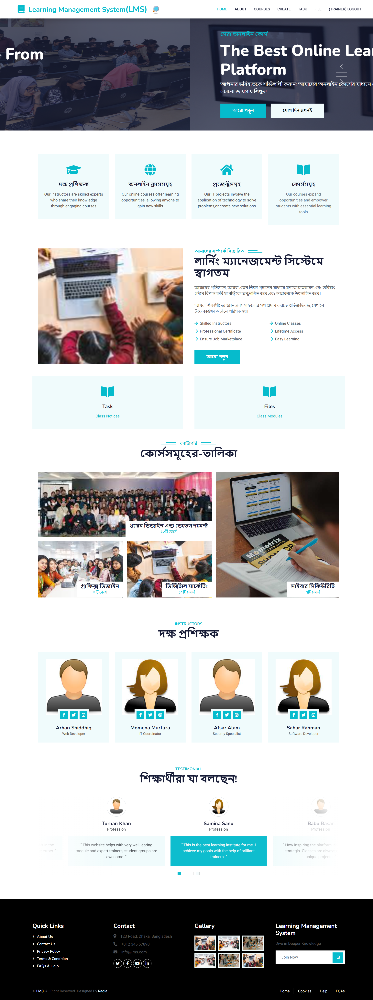

# 🎓 Learning Management System (LMS)

A modern and responsive **Learning Management System (LMS)** designed to provide students with an engaging online learning experience. The platform allows learners to explore courses, discover skilled instructors, browse learning categories, and access educational resources from one place.

The project focuses on creating a clean, accessible, and user-friendly interface for **online education and skill development**.

---

## 📸 Project Preview

<!-- Paste your screenshot directly below this line when editing the README on GitHub -->



---

## ✨ Overview

The Learning Management System provides a centralized platform where learners can discover educational content and explore opportunities for developing new skills.

The homepage is designed around a simple learning journey:

**Discover → Explore Courses → Learn → Build Skills**

The interface combines modern visual design with structured content to make educational resources easy to find and navigate.

---

## 🚀 Key Features

### 🎓 Course Discovery

Students can explore available courses through organized categories and visually engaging course sections.

### 👨‍🏫 Skilled Instructors

A dedicated instructor section introduces experienced trainers and highlights their areas of expertise.

### 📚 Course Categories

Courses are organized into different learning categories, helping students quickly find subjects that match their interests and goals.

### 🌐 Online Learning

The platform promotes flexible online education, allowing learners to develop skills from anywhere.

### 🏆 Professional Certification

The platform is designed to support professional development and certification-oriented learning.

### 💼 Career & Skill Development

The LMS focuses not only on learning but also on helping students build practical skills for their future careers.

### 💬 Student Testimonials

A testimonial section allows learners to share their experiences and feedback about the platform.

### 📱 Responsive Interface

The website is designed to provide a consistent experience across desktop, tablet, and mobile devices.

---

## 🖥️ Main Sections

The homepage contains several major sections:

| Section              | Description                                                                 |
| -------------------- | --------------------------------------------------------------------------- |
| 🏠 Hero Section      | Introduction to the learning platform with clear calls-to-action            |
| 🎯 Features          | Highlights instructors, online courses, IT projects, and learning resources |
| 📖 About             | Introduction to the LMS and its learning opportunities                      |
| 📚 Course Categories | Organized collection of available learning categories                       |
| 👨‍🏫 Instructors    | Profiles of skilled trainers and professionals                              |
| 💬 Testimonials      | Feedback and experiences from learners                                      |
| 📩 Footer            | Navigation, contact information, gallery, and newsletter signup             |

---

## 🎨 Design & User Experience

The interface was designed with a strong focus on **simplicity, readability, and visual hierarchy**.

### Design Principles

* Clean and modern layout
* Clear navigation
* Strong call-to-action buttons
* Consistent color scheme
* Card-based content organization
* Accessible typography
* Responsive sections
* Visual course categorization
* Student-focused user experience

The goal is to make the learning platform feel **welcoming, professional, and easy to navigate**.

---

## 🛠️ Technologies

> Update this section according to the technologies actually used in your repository.

* **HTML5** — Website structure
* **CSS3** — Styling and responsive design
* **JavaScript** — Interactive functionality
* **Bootstrap** — Responsive layout and UI components
* **Font Awesome** — Icons
* **Google Fonts** — Typography

---

## 📂 Project Structure

```text
Learning-Management-System/
│
├── assets/
│   ├── images/
│   ├── icons/
│   └── fonts/
│
├── css/
│   └── style.css
│
├── js/
│   └── script.js
│
├── pages/
│   ├── about.html
│   ├── courses.html
│   ├── instructors.html
│   └── login.html
│
├── index.html
└── README.md
```

> Adjust the structure above to match your actual project files.

---

## ⚙️ Getting Started

### Clone the repository

```bash
git clone https://github.com/YOUR-USERNAME/YOUR-REPOSITORY.git
```

### Navigate to the project

```bash
cd YOUR-REPOSITORY
```

### Run the project

If this is a static frontend project, simply open:

```text
index.html
```

in your browser.

For development, you can also use **VS Code Live Server** or another local development server.

---

## 📱 Responsive Design

The LMS is designed to adapt to different screen sizes and provide a smooth experience across:

* 💻 Desktop
* 📱 Mobile
* 📲 Tablet

Responsive layouts ensure that course information, instructor profiles, navigation, and other content remain accessible on smaller screens.

---

## 🔮 Future Improvements

The current interface provides the foundation for a complete LMS. Future versions could include:

* [ ] Student registration and authentication
* [ ] Student dashboard
* [ ] Instructor dashboard
* [ ] Course enrollment
* [ ] Course progress tracking
* [ ] Video-based lessons
* [ ] Online quizzes and assessments
* [ ] Course completion certificates
* [ ] Student-to-instructor communication
* [ ] Course search and filtering
* [ ] Payment integration
* [ ] Admin dashboard
* [ ] Database integration
* [ ] Learning analytics
* [ ] Personalized course recommendations

---

## 🎯 Project Goals

This project was created to explore how a modern online learning platform can organize educational resources while keeping the user experience simple and engaging.

The main goals are to:

1. Create an intuitive learning interface.
2. Make courses easy to discover.
3. Present instructors and learning categories clearly.
4. Provide a foundation for online education features.
5. Build a scalable foundation for a complete LMS.

---

## 🧠 What I Learned

Working on this project helped strengthen practical skills in:

* Responsive web design
* Frontend development
* UI/UX implementation
* Website layout and component organization
* Navigation design
* Working with reusable sections
* Creating responsive cards and grids
* Building educational platform interfaces
* Improving visual hierarchy and usability

---

## 📌 Project Status

**🚧 In Development**

The current version focuses primarily on the **frontend interface and user experience**. Backend functionality, authentication, course management, and other LMS features can be integrated as the project evolves.

---

## 👩‍💻 Author

**Radia**

**Computer Science & Engineering | Full-Stack Web Developer**

Passionate about building thoughtful web applications, continuously learning new technologies, and exploring the possibilities of **software development and AI**.

---

## ⭐ Support

If you find this project interesting, consider giving the repository a ⭐ on GitHub.

---

> **Learn. Build. Grow.**
>
> A learning platform designed to make knowledge more accessible and skill development more engaging.
